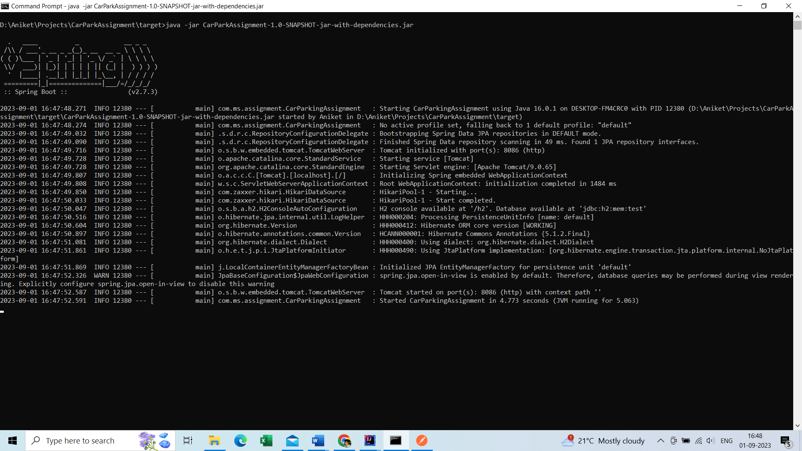
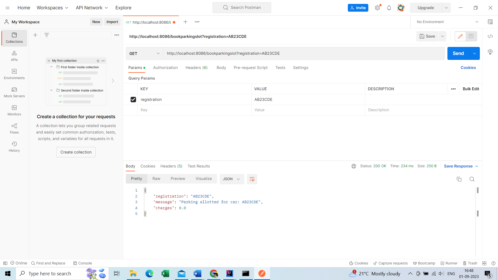
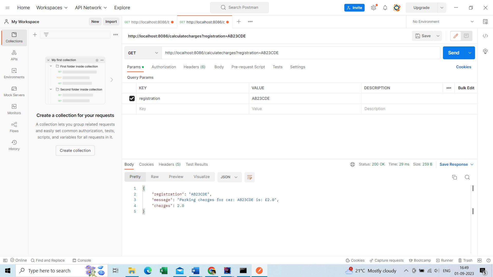
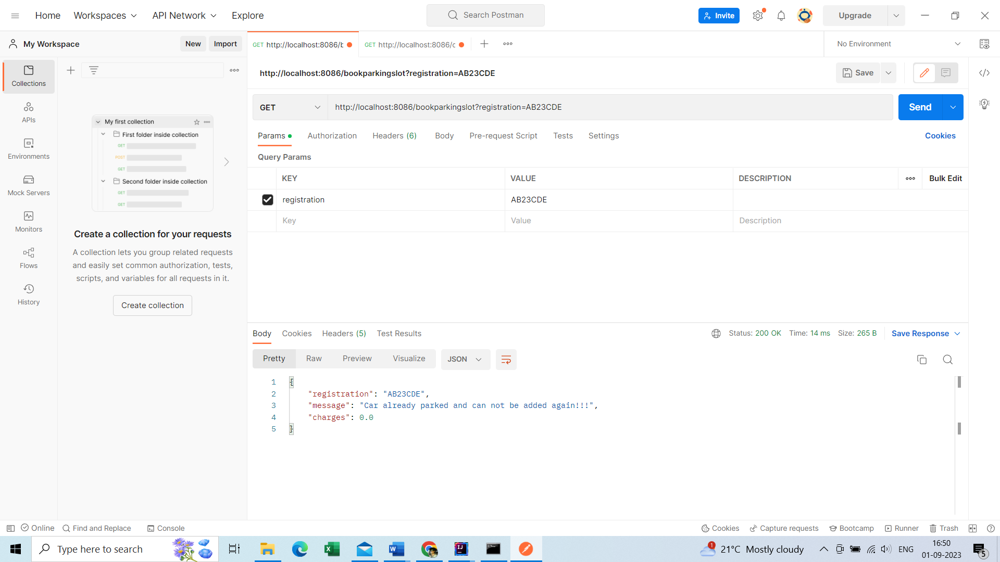
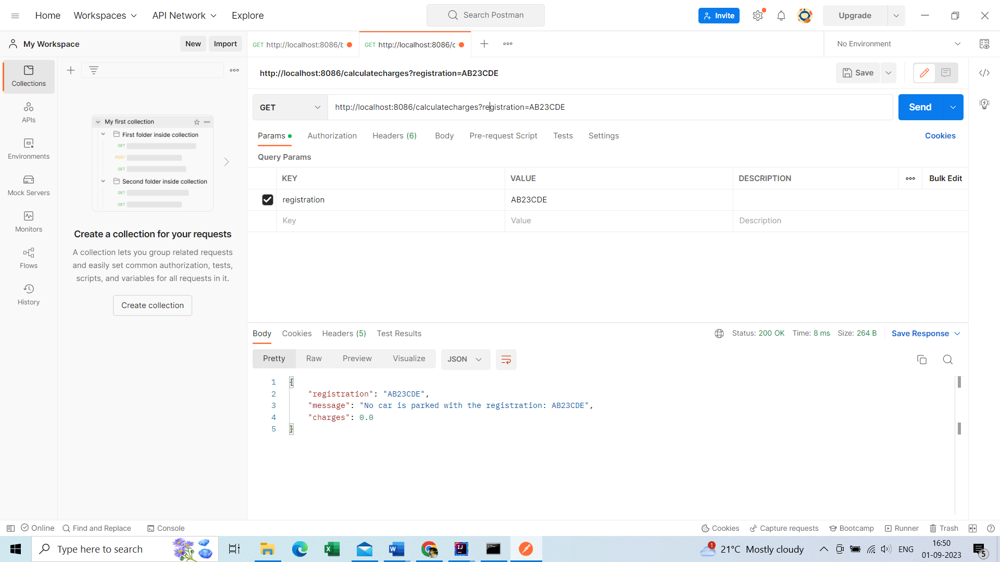

# Car Park Assignment

### Overview
Application keeps track of number of available parking slot. Return appropriate message when a car 
tries to acquire a parking slot depending upon availability. It calculate the parking charges when 
car is leaving.

### Requirements & Assumptions
1. Initial parking capacity is considered as 100. It will be set through config in variable.
2. 

### Libraries & Versions
1. JDK 16
2. Spring boot 2.7
3. Sping boot starter web/jpa/test
4. H2 database
5. junit-jupiter-5.8.2.jar

### Design
#### Entities:

#### APIs and REST endpoints

1. _**bookParkingSlot(registration)**_: This REST endpoint will book a parking slot if available. 
It first checks if the parking is full or not and return appropriate message. 
To handle multiple requests it will use lock api while checking the slot availability and adding the
new car to parking. It displays appropriate message in scenarios like adding the same car again, if the
parking is full and if any exceptions while saving down the parking details.

2. _**calaculteParkingCharges(registration)**_: This REST endpoint will calculate charges based on 
per hour charges and duration calculated based on current date/time and date/time at the time
of booking parking slot. It will apply minimum charge even if the car is parked for less than 1hr.
It will display appropriate message when car is not found in parking and if there is any issue while
processing the charges.

### Guidelines
Application Run:
1. Clone the repo. which already has jar file created, and it can be run separately. 
2. Copy jar (CarParkAssignment-1.0-SNAPSHOT-jar-with-dependencies.jar) from target folder in to dir. 
And run below commands from same dir.
3. To start application as Spring boot, run below command from command prompt:
   1. java -jar CarParkAssignment-1.0-SNAPSHOT-jar-with-dependencies.jar
   2. Use Postman/browser to add car to parking or to calculate charges. (See screenshots below)
   3. Sample command to add car: _http://localhost:8086/bookparkingslot?registration=AB23CDE_
   4. Sample Command to calculate charges: _http://localhost:8086/calculatecharges?registration=AB23CDE_
4. There are tests written which can be run to validate the different scenarios including invalid ones.
needs to be processed.

### Testing
Test cases covers below scenarios:
1. Valid scenarios to add car/calculate charges. 
2. Multiple scenarios like invalid inputs, negative scenario like adding the same car, car is not present 
in parking and some exceptions.

### Result Screenshots & Evidences 
1. Application startup:
   
2. Running application with valid input 
   1. Adding car:
      
   2. Charges calculation:
      
   3. Adding same car:
      
   4. Car not added in parking
      
